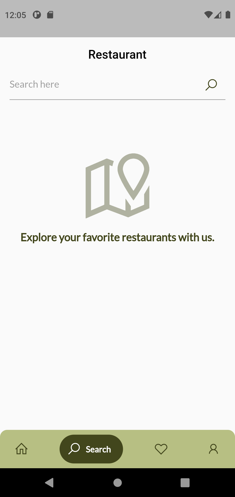

# Restaurant App

Project for completing submission of Dicoding Fundamental Flutter's course.

## Previews

Followings are the previews of the app:

<h3 align="center">
  SplashScreen
</h3>

    

<h3 align="center">
  Home Page
</h3>

    

<h3 align="center">
  Search Page
</h3>

    

<h3 align="center">
  Favorites Page
</h3>

    

<h3 align="center">
  Profile Page
</h3>

    

